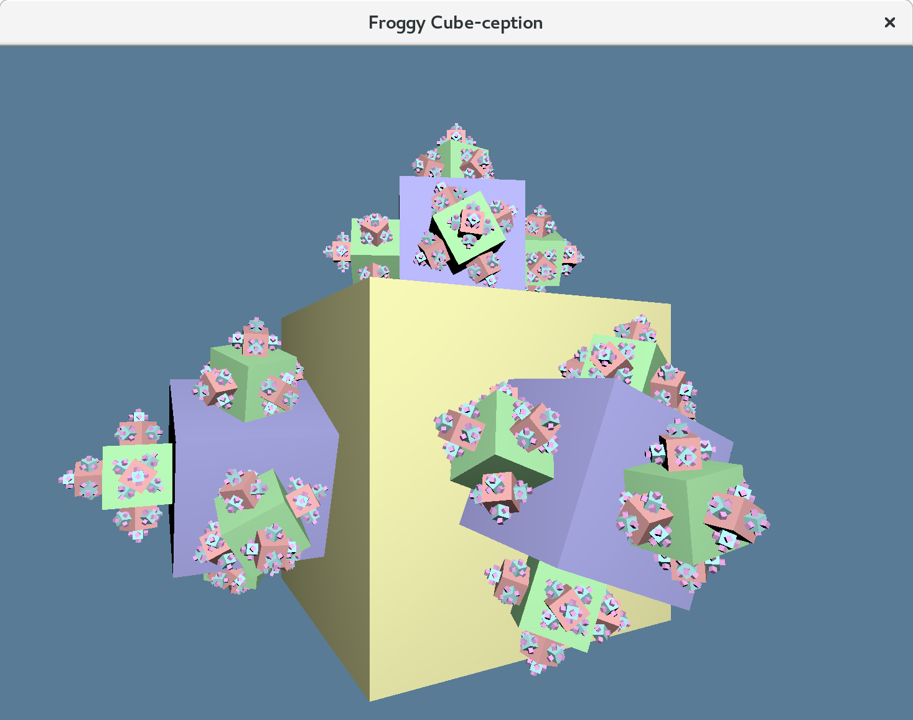

This demo shows a simple recursive animated cube. Aside from stealing hours of staring at it, the code can showcase a few concepts:

  - Creating multiple `froggy::Storage` containers and processing them on the same thread.
  - Working with a scene graph mapped to _froggy_.
  - Drawing fancy cubes with _gfx-rs_ instancing. It uses glutin/GL and even handles resizing properly.
  - Composing `cgmath::Decomposed` transforms and working with quaternions in the shaders.
